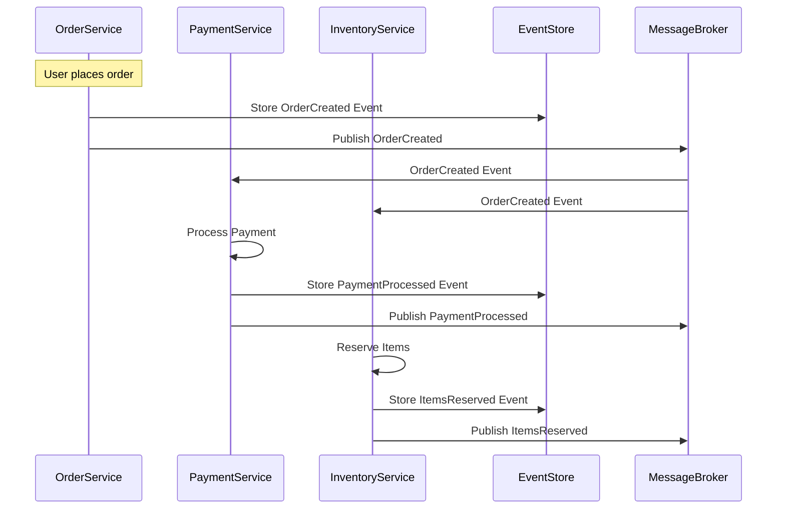
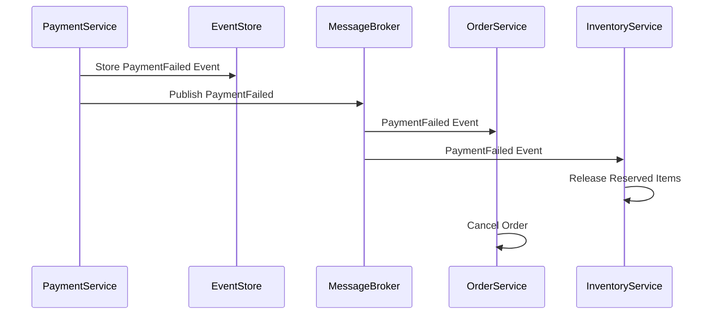
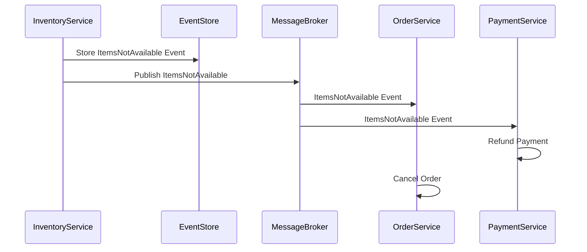

# Distributed Transactions in Boong Framework

## Overview

The Boong Framework implements distributed transactions using the Saga pattern and event choreography. This approach ensures data consistency across multiple microservices while maintaining system resilience and scalability.

## Architecture Components

### Event Store

- Persistent storage for all domain events
- Enables event sourcing and state reconstruction
- Provides complete audit trail of all transactions

### Message Broker

- Facilitates event distribution between services
- Ensures reliable message delivery
- Supports both Redis Streams and RabbitMQ

### Domain Events

- Represent business state changes
- Enable loose coupling between services
- Support eventual consistency model

## Implementation

### 1. Saga Pattern

```typescript
@Saga()
export class OrderProcessingSaga {
	@SagaStep()
	async processPayment(orderId: string) {
		return this.paymentService.processPayment(orderId);
	}

	@CompensationAction('processPayment')
	async refundPayment(orderId: string) {
		return this.paymentService.refundPayment(orderId);
	}
}
```

### 2. Event Flow

The typical flow of a distributed transaction follows these steps:

1. Initial event triggers the transaction
2. Each service processes its part of the transaction
3. Services emit events upon completion
4. Compensation actions handle failures

## Example: Order Processing



## Failure Handling

### Payment Failure Scenario



### Inventory Failure Scenario



## Best Practices

1. **Idempotency**

    - Ensure operations can be safely retried
    - Use unique transaction IDs
    - Implement idempotency checks

2. **Event Design**

    - Keep events immutable
    - Include all necessary context
    - Version your events

3. **Error Handling**

    - Define clear compensation actions
    - Log all failures
    - Implement retry mechanisms

4. **Monitoring**
    - Track transaction status
    - Monitor compensation actions
    - Set up alerts for failed transactions

## Benefits

1. **Resilience**

    - No single point of failure
    - Services can operate independently
    - Graceful degradation

2. **Scalability**

    - Horizontal scaling of services
    - Independent service deployment
    - Asynchronous processing

3. **Maintainability**

    - Clear transaction boundaries
    - Easy to add new services
    - Comprehensive audit trail

4. **Consistency**
    - Eventually consistent
    - Business invariants preserved
    - Complete transaction history

## Configuration

```typescript
// config/distributed-transaction.ts
export const distributedTransactionConfig = {
	retryAttempts: 3,
	retryDelay: 1000, // ms
	compensationTimeout: 5000, // ms
	eventStore: {
		type: 'postgres',
		tableName: 'event_store',
	},
	messageBroker: {
		type: 'redis-streams',
		// or 'rabbitmq'
		options: {
			// broker-specific options
		},
	},
};
```

## Usage Example

```typescript
@Controller('/api/orders')
export class OrderController {
	constructor(
		private orderSaga: OrderProcessingSaga,
		private eventBus: EventBus,
	) {}

	@Post('/')
	async createOrder(@Body() orderData: CreateOrderDTO) {
		// Start the distributed transaction
		const order = await this.orderSaga.start(orderData);

		// Publish the initial event
		await this.eventBus.publish(new OrderCreatedEvent(order));

		return order;
	}
}
```

## Debugging and Troubleshooting

1. **Event Store Queries**

    - View transaction history
    - Track event sequence
    - Identify failure points

2. **Message Broker Monitoring**

    - Check message queues
    - Monitor dead letter queues
    - Track message processing

3. **Common Issues**
    - Network timeouts
    - Message broker failures
    - Compensation action failures

## Performance Considerations

1. **Event Store Optimization**

    - Index frequently queried fields
    - Implement event snapshots
    - Archive old events

2. **Message Broker Tuning**

    - Configure appropriate TTL
    - Set queue size limits
    - Optimize consumer count

3. **Resource Management**
    - Connection pooling
    - Proper error handling
    - Resource cleanup

## Security

1. **Event Data**

    - Encrypt sensitive data
    - Implement access control
    - Audit logging

2. **Message Broker**
    - Secure connections
    - Authentication
    - Authorization

## Testing

1. **Unit Tests**

    - Test individual saga steps
    - Verify compensation actions
    - Check event handling

2. **Integration Tests**
    - End-to-end transaction flow
    - Failure scenarios
    - Performance testing

## Conclusion

The Boong Framework's distributed transaction implementation provides a robust, scalable solution for maintaining data consistency across microservices. By leveraging event sourcing and the saga pattern, it ensures reliable transaction processing while maintaining service autonomy and system resilience.
