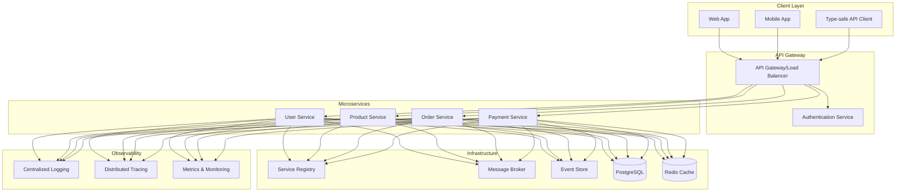
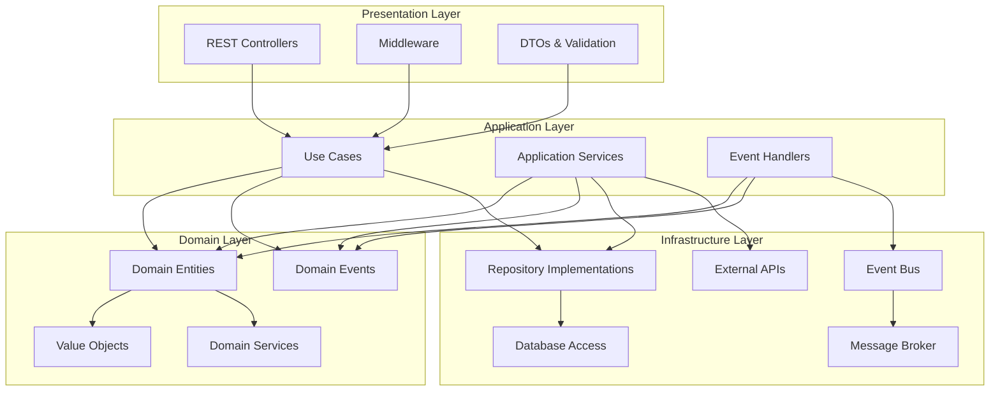
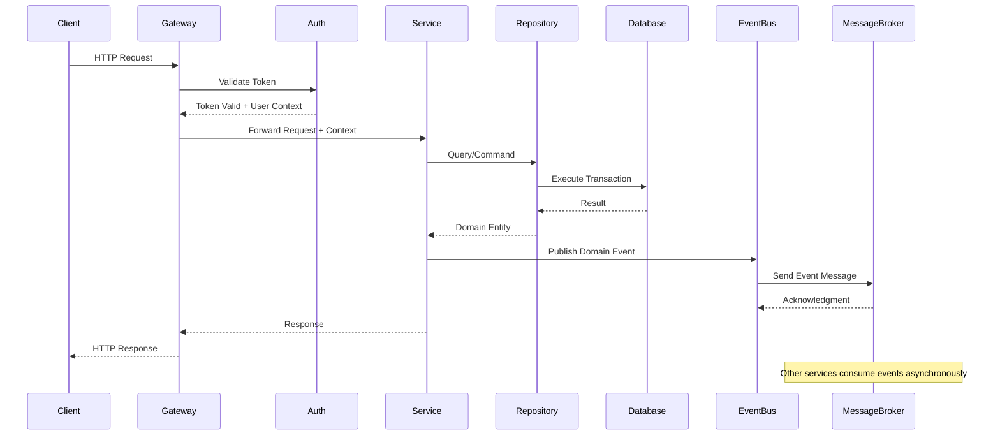
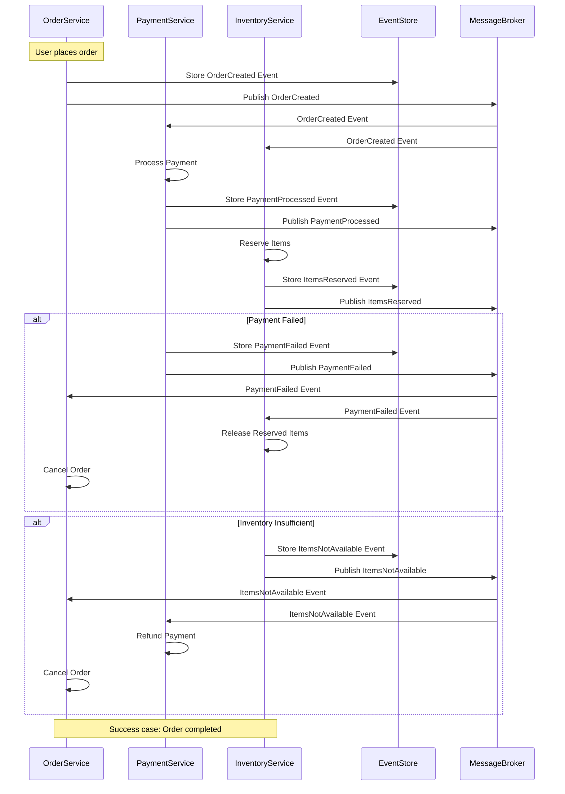
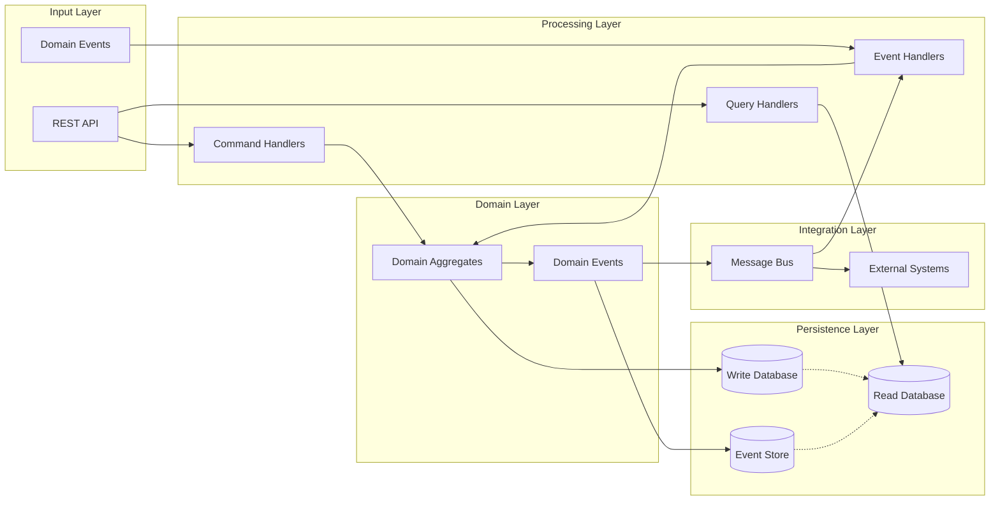

# Boong Framework

A next-generation microservices framework built on domain-driven design, clean architecture, and event sourcing principles.

## 🚀 Framework Overview

Boong is a comprehensive framework that combines the power of domain events, clean architecture, and modern TypeScript tooling to create scalable, maintainable microservices. Built on Bun runtime and Elysia, it provides automatic CRUD generation, distributed transactions, and event sourcing capabilities.

## 🎯 Core Principles

### Domain-Driven Design + Clean Architecture

- **Domain Layer**: Pure business logic with domain entities and events
- **Application Layer**: Use cases and application services
- **Infrastructure Layer**: Database, message brokers, external services
- **Presentation Layer**: REST APIs with automatic documentation

### Event-Driven Architecture

- Domain events for business logic communication
- Event sourcing for audit trails and state reconstruction
- Distributed transaction coordination via event choreography

## 📋 Detailed Implementation Plan

### Phase 1: Core Framework Infrastructure

1. **Project Structure Setup**

    - Clean architecture folder structure
    - Dependency injection container
    - Configuration management
    - Environment-specific settings

2. **Database Layer**

    - Drizzle ORM integration
    - PostgreSQL connection pooling
    - Transaction management
    - Migration system

3. **Event System**
    - Domain event base classes
    - Event bus implementation
    - Event store for event sourcing
    - Message broker integration (Redis Streams/RabbitMQ)

### Phase 2: Service Infrastructure

1. **Service Discovery & Registry**

    - Service registration on startup
    - Health check endpoints
    - Load balancing support
    - Service mesh integration ready

2. **API Framework**

    - Elysia-based REST API
    - Automatic OpenAPI/Swagger generation
    - Request/response validation
    - Error handling middleware

3. **Observability**
    - Structured logging with correlation IDs
    - Distributed tracing (OpenTelemetry)
    - Metrics collection
    - Health monitoring

### Phase 3: Developer Experience

1. **Code Generation**

    - CRUD operations from Drizzle schema
    - TypeScript interfaces
    - API client generation
    - Repository patterns

2. **Security & Multi-tenancy**

    - JWT-based authentication
    - Role-based access control (RBAC)
    - Tenant isolation
    - API endpoint protection

3. **Developer Tools**
    - CLI for scaffolding
    - Hot reloading
    - Testing utilities
    - Database seeding

### Phase 4: Advanced Features

1. **Distributed Transactions**

    - Saga pattern implementation
    - Compensation actions
    - Transaction state management
    - Rollback mechanisms

2. **Event Sourcing**
    - Event store implementation
    - Snapshot management
    - Projection rebuilding
    - Event replay capabilities

## 🏗️ Architecture Diagrams

### System Architecture



### Clean Architecture Layers



### API Request Flow



### Event Flow & Distributed Transaction



### Data Flow Architecture



## 🛠️ Technical Stack

### Runtime & Framework

- **Bun**: Ultra-fast JavaScript runtime
- **Elysia**: High-performance web framework
- **TypeScript**: Full type safety

### Database & ORM

- **PostgreSQL**: Primary database
- **Drizzle ORM**: Type-safe database access
- **Redis**: Caching and session storage

### Message Broker

- **Redis Streams**: Lightweight event streaming
- **RabbitMQ**: Enterprise message broker (optional)

### Observability

- **OpenTelemetry**: Distributed tracing
- **Pino**: High-performance logging
- **Prometheus**: Metrics collection

### Development Tools

- **Swagger/OpenAPI**: API documentation
- **TypeBox**: Runtime validation
- **Jest**: Testing framework

## 🔧 Core Features

### 1. Automatic CRUD Generation

```typescript
// Define your schema
export const users = pgTable('users', {
	id: uuid('id').primaryKey(),
	email: varchar('email', { length: 255 }).notNull(),
	name: varchar('name', { length: 255 }),
	createdAt: timestamp('created_at').defaultNow(),
});

// CRUD operations are automatically generated
@AutoCRUD(users)
@Service()
export class UserService extends BaseCRUDService<typeof users> {
	// Custom business logic here
	async createUserWithWelcomeEmail(userData: CreateUserDTO) {
		const user = await this.create(userData);
		await this.eventBus.publish(new UserCreatedEvent(user));
		return user;
	}
}
```

### 2. Domain Events & Event Sourcing

```typescript
@DomainEvent('user.created')
export class UserCreatedEvent extends BaseEvent {
	constructor(public readonly user: User) {
		super();
	}
}

@EventHandler(UserCreatedEvent)
export class UserCreatedHandler {
	async handle(event: UserCreatedEvent) {
		// Send welcome email
		await this.emailService.sendWelcomeEmail(event.user);
	}
}
```

### 3. Multi-tenant RBAC

```typescript
@Controller('/api/users')
@RequireTenant()
export class UserController {
	@Get('/')
	@RequireRole(['admin', 'manager'])
	async getUsers(@TenantId() tenantId: string) {
		return this.userService.findByTenant(tenantId);
	}
}
```

### 4. Distributed Transactions

```typescript
@Saga()
export class OrderProcessingSaga {
	@SagaStep()
	async processPayment(orderId: string) {
		return this.paymentService.processPayment(orderId);
	}

	@CompensationAction('processPayment')
	async refundPayment(orderId: string) {
		return this.paymentService.refundPayment(orderId);
	}
}
```

### 5. Type-safe API Client

```typescript
// Automatically generated from your API
const api = createApiClient<AppAPI>({
	baseUrl: 'https://api.example.com',
	token: 'your-jwt-token',
});

// Full TypeScript support
const users = await api.users.getAll(); // Type: User[]
const user = await api.users.getById('123'); // Type: User | null
```

## 🚀 Getting Started

### Installation

```bash
bun create boong-framework my-app
cd my-app
bun install
```

### Project Structure

```
src/
├── application/          # Use cases and application services
├── domain/              # Domain entities, events, and services
├── infrastructure/      # Database, message brokers, external APIs
├── presentation/        # REST controllers and DTOs
├── shared/             # Shared utilities and types
└── main.ts            # Application entry point
```

### Quick Start

```bash
# Generate a new service
bun boong generate service User

# Generate CRUD from schema
bun boong generate crud --schema=users

# Start development server
bun dev

# Run migrations
bun migrate

# Generate API client
bun boong generate client
```

## 📚 Documentation

### API Documentation

- Auto-generated Swagger UI available at `/docs`
- OpenAPI 3.0 specification
- Interactive API explorer

### Development Guidelines

1. **Domain-First**: Start with domain modeling
2. **Event-Driven**: Use domain events for decoupling
3. **Test-Driven**: Write tests for business logic
4. **API-First**: Design APIs before implementation

## 🔒 Security Features

- JWT-based authentication
- Role-based access control (RBAC)
- Multi-tenant data isolation
- Rate limiting and throttling
- Input validation and sanitization
- CORS and security headers

## 📈 Performance Features

- Connection pooling
- Redis caching
- Query optimization
- Horizontal scaling
- Load balancing
- Circuit breakers

## 🧪 Testing

```bash
# Run unit tests
bun test

# Run integration tests
bun test:integration

# Run e2e tests
bun test:e2e

# Generate test coverage
bun test:coverage
```

## 📦 Deployment

### Docker Support

```dockerfile
FROM oven/bun:1.2-slim
WORKDIR /app
COPY package.json bun.lockb ./
RUN bun install --frozen-lockfile
COPY . .
EXPOSE 3000
CMD ["bun", "start"]
```

### Kubernetes Ready

- Health check endpoints
- Graceful shutdown
- Environment configuration
- Helm charts included

## 🤝 Contributing

1. Fork the repository
2. Create your feature branch (`git checkout -b feature/amazing-feature`)
3. Commit your changes (`git commit -m 'Add some amazing feature'`)
4. Push to the branch (`git push origin feature/amazing-feature`)
5. Open a Pull Request

## 📄 License

This project is licensed under the MIT License - see the [LICENSE](LICENSE) file for details.

## 🎯 Roadmap

- [ ] GraphQL support
- [ ] gRPC integration
- [ ] WebSocket real-time features
- [ ] Advanced monitoring dashboard
- [ ] AI-powered code generation
- [ ] Blockchain event sourcing

---

Built with ❤️ using Bun and TypeScript
